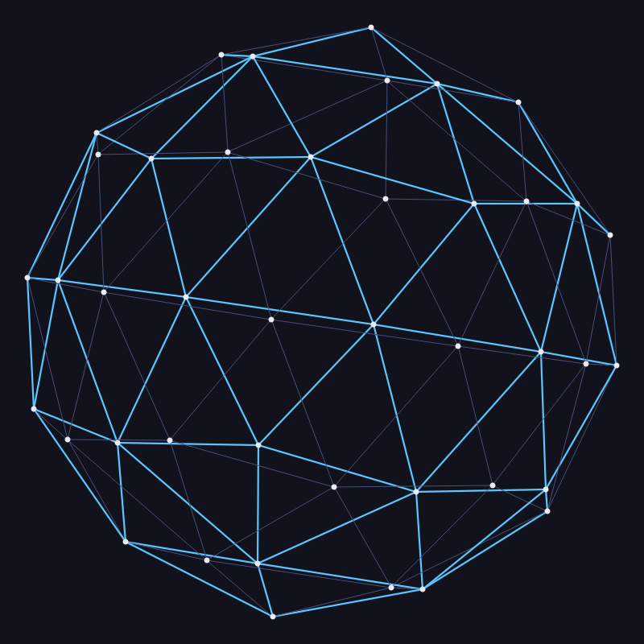
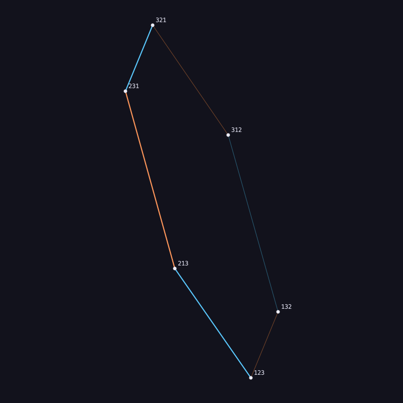
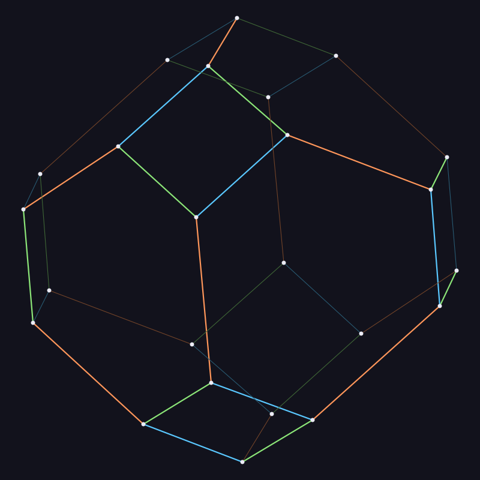
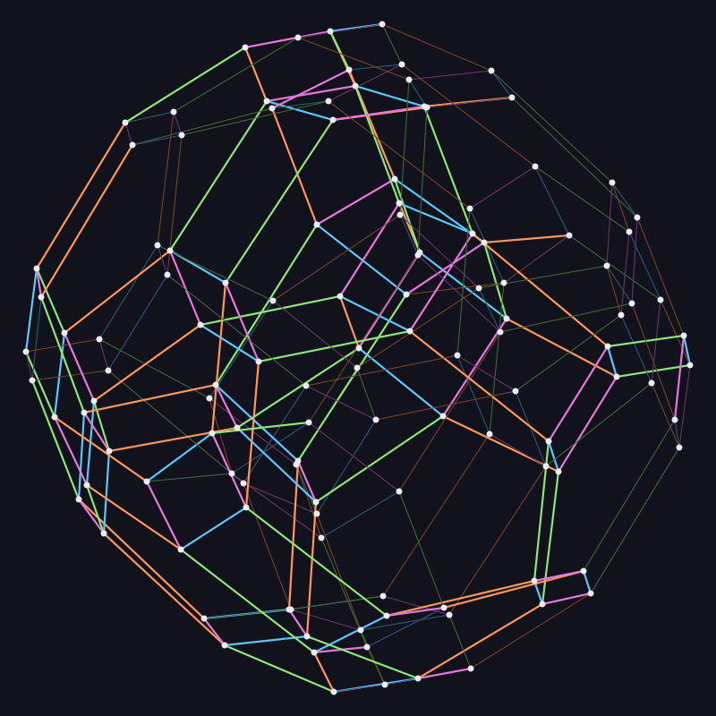
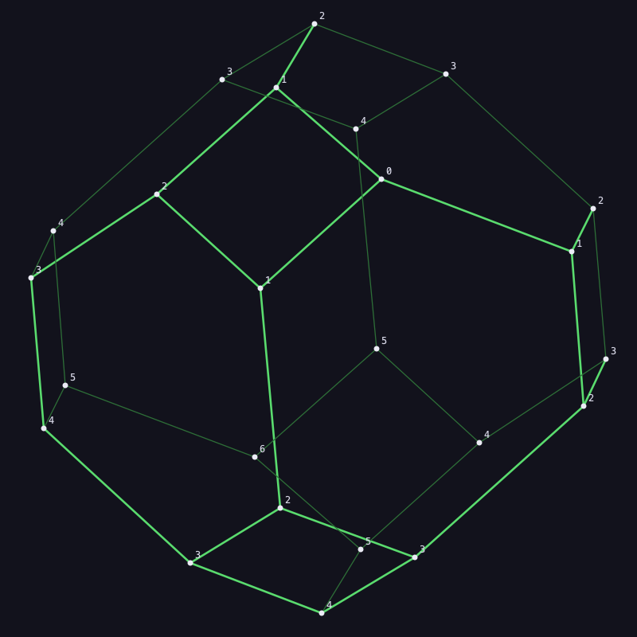
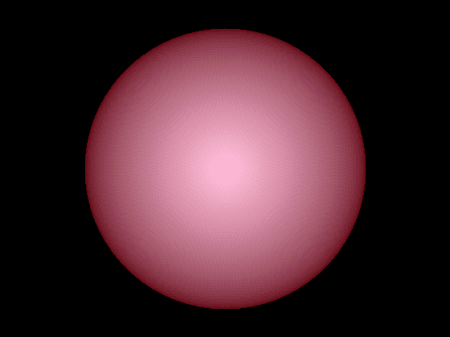

# permuto — Polytop / Permutograph viewer

A **PySide6** reincarnation of Christian Tismer's 1990–95 Modula-2
**Polytop / Permutograph** viewer.

A *permutograph* has permutations as nodes and *operators* (products of position
cycles) as edges; the viewer embeds it in up to eight dimensions, relaxes it into
a symmetric shape, and shows a rotating orthographic **N-D → 2-D projection**.
Because the objects are genuinely 4-D and higher, that rotating projection — not
a 3-D render — is what reveals the structure.

It also contains **SIMONE** (`/I` mode), a small simulation of the Iridium
satellite constellation with adaptive packet routing, on the same engine.

## Provenance

Written 1990–95 (TopSpeed / JPI Modula-2, DOS) by a small research group —
Gerhard G. Thomas, Horst Hüske, and Christian Tismer — exploring Gotthard
Günther's *negation cycles / permutographs*, with Prof. Bernhard Mitterauer in
Salzburg joining now and then. The group even visited Motorola — Jeff Myers — to
pitch ideas around the early **Iridium** satellite project (77, then 66
satellites), which is where the SIMONE routing simulation comes from; the design
notes that came back from that trip are still in the archive as
`legacy/modula/salzdemo.txt`.

The original source was deleted years ago and survived only as an encrypted ZIP
attached to a 1997 e-mail, recovered from a Thunderbird archive in 2026 and
ported here. The recovered Modula-2 original is kept under `legacy/` for
reference; the branch `recovered-original` holds the pristine import.

Theory & context: Gotthard Günther's work, [vordenker.de](https://www.vordenker.de).

## Gallery

Headless renders (`python -m permuto render <name>`):

| icosahedron (`ikosa2`) | S₃ permutohedron, labelled (`pgl3`) |
|---|---|
|  |  |
| **S₄ permutohedron, operators coloured (`pgl4`)** | **S₅ permutohedron, 120 nodes (`pgl5`)** |
|  |  |

Edges are coloured by which *operator* produced them — the parallel edge-classes
of the permutohedron become visible. **Program mode** (`P` then `S`) runs the SPA
on the graph, labelling every node with its distance from the start and colouring
the shortest-path edges:



Also recovered: **`kugel`**, a 1991 study in making 14 colours look like a lit
sphere — a hand-mixed ramp plus dithering, one octant computed and mirrored
eight ways so no seams show (`permuto kugel`, `--floyd` for Floyd-Steinberg
instead of the ordered pattern):




## Install & run

Requires Python 3.10+ (PySide6 is pulled in automatically). One command:

```bash
pip install git+https://github.com/ctismer/permuto
permuto                   # just start (permutograph mode, default 1234)
permuto show pgl4         # the sample graphs are bundled -- no extra download
```

For development, clone and `pip install -e .` instead.

```bash
python -m permuto show pgl4                 # a named graph (legacy/modula/nod/)
python -m permuto show 1234 12 + 23 + 34    # build from base + operators
python -m permuto show 11111112 1234 + 5678 + 18 27 + 36 45   # the cube
python -m permuto show session.pms          # resume a saved session
python -m permuto iridium                   # the SIMONE / Iridium simulation
```

Non-interactive:

```bash
python -m permuto gen 123 12 + 23           # edge list on stdout
python -m permuto render pgl5 out.png 700   # offscreen PNG
python -m permuto export pgl4 out.ps 600    # runnable PostScript
python -m permuto convert old.ply new.pms   # migrate a binary session
permuto kugel out.png 800 [--floyd]         # the 1991 colour study
```

Viewer keys follow the original: `A` algorithm · `C` calc · `R` run ·
`H` hurry · `S` spin · `N` labels · `F` file menu · `P` program menu (SPA /
ParSum) · `E` edit operators. It single-steps until you press `R`.

## What's inside

| path | |
|---|---|
| `src/permuto/core/` | UI-free engine: fixed-point vectors, graph model, `PCalc` layout, `PmProgs` (SPA/ParSum), `PM` (operator editing), `Iri` (SIMONE) |
| `src/permuto/gen/` | generators: the `genperm`/`operate`/`num2` pipeline, geodesic icosahedra, factorisation, the `vierdrei` graph |
| `src/permuto/formats/` | `.pg`/`.nod`/`.pgd` readers, binary `.ply` (read) and the text `.pms` session format, PostScript export |
| `src/permuto/ui/` | the PySide6 viewer and offscreen renderer |
| `src/permuto/studies/` | standalone experiments from the original: `kugel`, the colour/dither study |
| `legacy/` | the recovered 1990s Modula-2 original |
| `docs/` | `ARCHITECTURE.md` (formats, the fixed-point maths), `PORT-GAPS.md` |

The core is deliberately UI-free, so a later TypeScript/web frontend can reuse
it. Arithmetic is 32-bit integer fixed point (`NORM = 2**24` as "1.0"); there is
no floating point in the layout, exactly as in the original ("absolutely no more
REAL necessary. 11k code saved" — a comment from 1991).

## Sessions

A session saves the whole relaxed state — coordinates, topology, operators,
program/Iridium state and the iteration counter — as **`.pms`**, a line-oriented
text format in the family of `.nod`/`.pgd`. It is diffable, hand-editable, and a
truncated file is salvaged with a warning rather than rejected. The 1990s binary
`.ply` files still load (and are the round-trip oracle in the tests).

## Tests

```bash
python -m pytest
```

The strong ones check against the original data: the generation pipeline
regenerates 11 recovered graphs byte-for-byte; `PM` reproduces the permutations,
edges and operator numbers of the surviving `.ply` files; the geodesic generator
is graph-isomorphic to all twelve `ikosa*.nod`; SPA distances match an
independent BFS.
